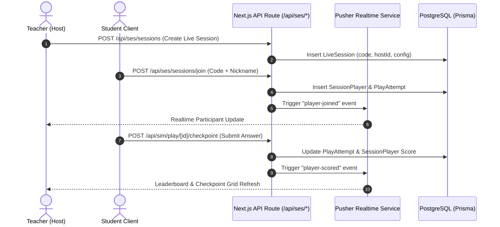

# Page Specification: Classroom Live Sessions & Teaching Dashboard

## 1. Overview & Scope
The Teaching & Classroom Monitoring suite allows teachers and session hosts to run interactive multiplayer lab sessions, monitor participant progress in real time, and inspect session analytics.

- **Teaching Hub (`/teaching`)**:
  - Class management, session history, and quick-launch templates.
- **Session Control Room & Host View (`/p/[...slug]` in host mode)**:
  - Real-time hub for teachers while a live classroom experiment is active.
  - Displays unique **Join Code** and **QR Code** for student admissions.
  - **Live Progress Grid**: Tracks checkpoint completions and accuracy across connected students.
  - **Real-Time Leaderboard**: Ranks students based on checkpoints passed and XP scored.
  - **Host Session Flow**: Allows the host to advance stages (Engage -> Explore -> Checkpoints -> Results).
- **Session Analytics Detail (`/teaching/(group)/analytics/[id]`)**:
  - Post-session review showing average scores, question-by-question breakdown, and individual student attempt metrics.

---

## 2. Real-Time Synchronization Layer (Pusher)

Session state is kept in sync across host and student devices using Pusher channels (`presence-` / `private-` / `public-` session channels):

---

## 3. Key API Endpoints (5-Suite Taxonomy: `ses` & `sim`)
- `ses:session:post:create` (`POST /api/ses/sessions`) — Initializes a new live session with join code.
- `ses:session:post:join` (`POST /api/ses/sessions/join`) — Registers a student into the session lobby.
- `ses:session:post:end` (`POST /api/ses/sessions/[id]/end`) — Concludes session and locks leaderboard.
- `ses:analytics:get:metrics` (`GET /api/ses/analytics/[id]/metrics`) — Computes average score, accuracy, completion percentage.
- `ses:analytics:get:info` (`GET /api/ses/analytics/[id]/info`) — Fetches session metadata and configuration.
