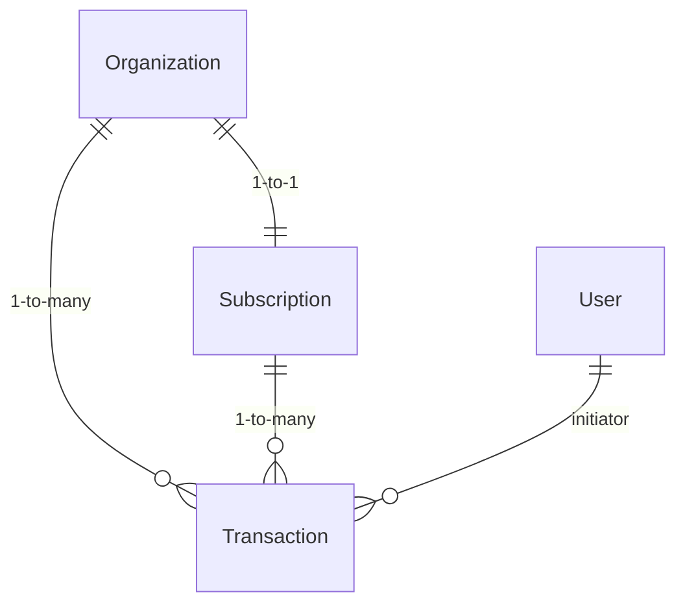

# Page Specification: Licensing & Paystack Billing

## 1. Overview & Architecture
OpenLearn XR uses **Paystack** as its primary payment processor for subscriptions and multi-seat licenses across Ghana and West Africa.
- **Frontend Integration**: Inline popup checkout via `@paystack/inline-js` in `tab.student.lisense.tsx` and `tab.teacher.lisense.tsx`.
- **Backend API**:
  - `GET /api/app/onboarding/licensing` — Queries pending transactions, verifies status against Paystack API, and checks active subscriptions.
  - `PATCH /api/app/onboarding/licensing` — Creates/updates the user's organization workspace, provisions Free tier subscriptions, or initiates Paystack transactions for paid plans.
  - `POST /api/webhoooks/paystack` — Serverless webhook listener validating HMAC SHA512 signatures (`x-paystack-signature`) for background lifecycle events.

---

## 2. Subscription Tiers & Billing Matrix

| Tier | Target Audience | Seats / Host Access | Pricing (GHS) | Billing Provider |
| :--- | :--- | :--- | :--- | :--- |
| **Free** | Individual Students & Solo Explorers | 1 User (Solo) | Free | Direct DB provision |
| **Pro / Solo Teacher** | Individual Teachers | 1 Host Seat, up to 3 active concurrent sessions | ~75 GHS / mo | Paystack Plan Subscription |
| **Department** | Subject Teams / Small Departments | Up to 10 Host Seats, shared organization dashboard | ~300 GHS / mo | Paystack Plan Subscription |
| **Enterprise / School** | Full School / Ministry Deployments | Unlimited Host Seats, Wildcard domain matching | Custom Invoice | Paystack / Enterprise Contract |

---

## 3. Database & Data Model Layer (Prisma)

- **`Subscription`**: Enforces a strict 1-to-1 relation with `Organization` (`organizationId @unique`).
  - Identifiers: `paystackSubCode` (`@unique`), `paystackEmailToken`, `paystackCustomerCode`.
  - Status: `"ACTIVE" | "EXPIRED" | "CANCELLED" | "PAST_DUE"`.
- **`Transaction`**: Tracks individual payment records linked to `subscriptionId` and `organizationId`.
  - Identifiers: `reference` (`@unique`), `accessCode`, `amount` (in pesewas), `channel`, `status` (`"PENDING" | "SUCCESS" | "FAILED" | "ABANDONED"`).

---

## 4. Webhook Processing (`/api/webhoooks/paystack`)
Handles automated asynchronous lifecycle events:
1. `charge.success`: Verifies payment, marks `Transaction` status to `"SUCCESS"`, and updates/creates active `Subscription`.
2. `subscription.create`: Stores `paystackSubCode`, `paystackEmailToken`, and `currentPeriodEnd`.
3. `invoice.update`: Records subscription renewal transactions.
4. `subscription.disable`: Marks `Subscription` status as `"CANCELLED"`.
