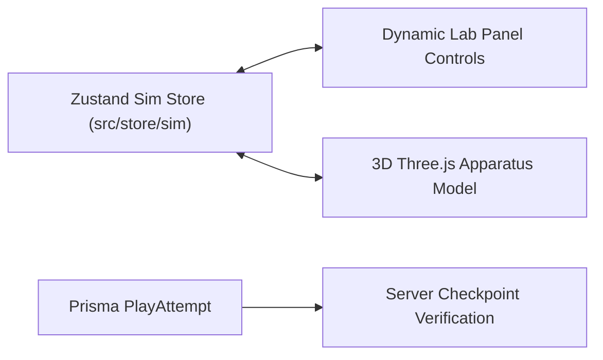

# Page Specification: Simulation Play & 3D Interactive Canvas

## 1. Overview & Route Architecture
The simulation player resides at `/p/[...slug]` and supports multiple play modes via a unified multi-stage flow:

- **Path**: `/p/[...slug]`
  - `mode`: `"session"` (multiplayer classroom), `"library"` (sequential syllabus), `"module"` (free-roam explorer).
  - `id` / `slug`: Identifier for the active session or module version.

### Multi-Stage Flow Components
1. **Engage (`flow.engage.tsx`)**:
   - Displays curiosity questions and the pre-assessment quiz before beginning practical interaction.
2. **Explore (`flow.explore.tsx` & `flow.explore.internal.tsx`)**:
   - **Shared 3D Canvas**: React Three Fiber (R3F) container with standardized camera, lighting, and HDR environment.
   - **Apparatus Mesh Injection**: Dynamic 3D model injection from module registry.
   - **Floating Dynamic Lab Panel**: Renders interactive control blocks (`slider`, `toggle`, `number`, `select`) bound to the Zustand simulation store.
3. **Checkpoints (`flow.checkpoint.tsx`)**:
   - Sequential comprehension questions verified against the server via `PlayAttempt`.
4. **Results (`flow.result.host.tsx` & `flow.result.player.tsx`)**:
   - Performance summaries, accuracy metrics, and XP distribution.

---

## 2. State & Data Layer

- **`PlayAttempt`**: Acts as a transactional scratchpad for solo and session plays to prevent client-side XP manipulation.
- **`ModuleCompletion`**: Created upon final completion to track long-term student progress.
