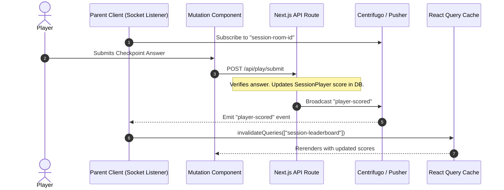
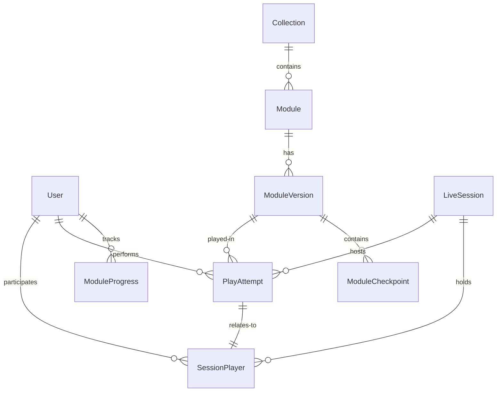
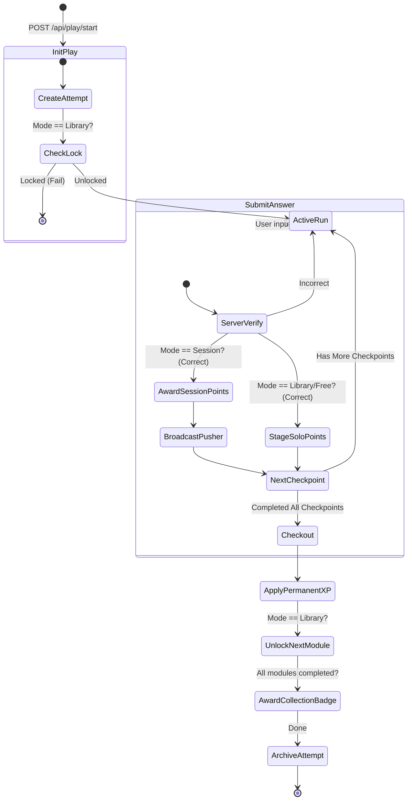

# Playground & Module Play Architecture

This document describes the unified architecture for the Open Learn XR Playground, explaining how we manage state, verify checkpoints, handle points, and track user progression across three distinct play modes without creating database schema clutter.

---

## 1. Play Modes & Requirements Matrix

| Feature / Rule | 1. Session Mode (`session`) | 2. Library Mode (`library`) | 3. Free Roam Mode (`module`) |
| :--- | :--- | :--- | :--- |
| **Access Path** | Joined via session lobby | Library page (Collection detail) | Modules search page (Free roam) |
| **Real-time (Pusher)**| Yes (Leaderboard sync) | No | No |
| **Player Identity** | Anonymous (Nickname/Group name)| Authenticated (`userId`) | Authenticated (`userId`) |
| **Locking Constraints**| None | Linear lock (Must finish previous) | None (Play any version) |
| **Point Accumulation** | Real-time (Awarded instantly) | Staged (Awarded only at checkout) | Staged (Awarded only at checkout) |
| **Streak Contribution**| No | Yes | Yes |
| **Collection Badges** | No | Yes (The only badge source) | No |
| **Exit Page Behavior** | Quiet leave (No XP impact) | Warn user of lost staged points | Warn user of lost staged points |

---

## 2. Key Architecture Challenges & Solutions

### A. State Fracturing & Unsaved Points
* **Challenge**: When playing solo (Library or Free Roam), points should not be awarded permanently to `User.xp` for every single question to prevent partial saves or manipulation. However, we still need to track which checkpoints have been answered during the run.
* **Solution**: Introduce a **`PlayAttempt`** table in the database that acts as a temporary scratchpad for the current play session. Points are accumulated under this attempt, and only pushed to the user's profile upon successful completion.

### B. Server-Side Checkpoint Verification
* **Challenge**: The server must verify answers to prevent client-side spoofing. The server needs to know exactly which checkpoint is active for a given playthrough.
* **Solution**: `PlayAttempt` tracks the `currentCheckpointIndex`. When a client submits an answer, the server fetches the checkpoint matching the index, verifies it, and increments the index only upon a correct answer.

### C. Linear Unlocking in Library Mode
* **Challenge**: Prevent users from playing advanced modules in a collection without completing the preceding ones.
* **Solution**: A module $M_i$ in a collection is considered unlocked if it is the first module (`orderIndex = 0`), or if the previous module $M_{i-1}$ has a corresponding `ModuleProgress` record with `isCompleted = true`. This logic is calculated dynamically during queries rather than updating lock flags in the database.

---

## 3. Real-Time Synchronization Pattern (React Query + Websockets)

For **Session Mode**, we adopt a clean, decoupled pattern where the connection lifecycle is managed at the parent page, while query invalidation triggers automatic refetching for active UI components:



* **Single Connection**: Established once at the parent `ClientPage` page level.
* **Decoupled Inner Components**: Components rendering leaderboard or progress indicators remain ignorant of WebSockets; they simply query via `useApi.query("public:session:get:leaderboard")`.
* **Targeted Invalidation**: Upon receiving the broadcast, the parent client calls `queryClient.invalidateQueries` to refresh the active data.

---

## 4. Proposed Database Models & Relationships



### A. Refactored / New Models (Prisma Schema)

```prisma
// Tracks active playthroughs to maintain state, verify progress, and stage points
model PlayAttempt {
  id                  String         @id @default(cuid())
  userId              String?        // Null for anonymous session players
  sessionId           String?        // Null for solo (Library / Free) play
  moduleVersionId     String
  playMode            String         // "session" | "library" | "free"
  
  // State
  currentCheckpointIndex Int         @default(0)   // Tracks which checkpoint index is next
  accumulatedPoints      Int         @default(0)   // Staged points during this attempt
  
  // Session details
  sessionPlayerId     String?        @unique       // Links directly to the session leaderboard record
  
  createdAt           DateTime       @default(now())
  updatedAt           DateTime       @updatedAt

  user                User?          @relation(fields: [userId], references: [id], onDelete: Cascade)
  session             LiveSession?   @relation(fields: [sessionId], references: [id], onDelete: Cascade)
  moduleVersion       ModuleVersion  @relation(fields: [moduleVersionId], references: [id], onDelete: Cascade)
  sessionPlayer       SessionPlayer? @relation(fields: [sessionPlayerId], references: [id], onDelete: SetNull)

  @@index([userId, moduleVersionId])
  @@map("play_attempt")
}

// Tracks permanent user unlocks and stats per module (No changes needed, aligns with schema.base.ts)
model ModuleProgress {
  id                  String         @id @default(cuid())
  userId              String
  moduleId            String
  lastPlayedVersionId String?
  isUnlocked          Boolean        @default(false)
  isCompleted         Boolean        @default(false)
  highScore           Int            @default(0)
  totalPlays          Int            @default(0)
  lastPlayedAt        DateTime?
  playMode            String         @default("free") // "free" | "controlled"
  completedAt         DateTime?
  createdAt           DateTime       @default(now())
  updatedAt           DateTime       @updatedAt

  user                User           @relation(fields: [userId], references: [id], onDelete: Cascade)
  module              Module         @relation(fields: [moduleId], references: [id], onDelete: Cascade)
  
  @@unique([userId, moduleId])
  @@map("module_progress")
}
```

---

## 5. Play Loop Execution Lifecycle



### 1. Starting Play (`POST /api/play/start`)
* Client requests play initialization with `moduleVersionId` and `playMode`.
* Server verifies locking (if `library` mode).
* Server creates a new `PlayAttempt` record with `currentCheckpointIndex = 0` and `accumulatedPoints = 0`.
* For `session` mode, server connects `PlayAttempt` to the `SessionPlayer`.

### 2. Answering Checkpoints (`POST /api/play/submit`)
* Client submits the answer for the current checkpoint along with `attemptId`.
* Server verifies:
  1. That the attempt is active.
  2. The submitted answer matches `ModuleCheckpoint.correctAnswer` at index `currentCheckpointIndex`.
* If correct:
  * **Session Mode**: Adds points immediately to `SessionPlayer.score` and broadcasts the new leaderboard over Pusher.
  * **Library / Free Roam**: Increments `accumulatedPoints` on the `PlayAttempt` record (persisted server-side but not added to `User.xp` yet).
  * Increments `currentCheckpointIndex` on `PlayAttempt`.

### 3. Completing Play (`POST /api/play/complete`)
* Client requests playthrough completion.
* Server checks if `currentCheckpointIndex` equals the total checkpoints for that version.
* If correct:
  * Adds `accumulatedPoints` to the user's permanent profile (`User.xp` and `GamificationLog`).
  * Creates or updates `ModuleProgress` to `isCompleted = true`, updates `highScore`, and increments `totalPlays`.
  * If `library` mode: evaluates if the entire collection has now been completed, and issues the respective collection badge.
  * Deletes or archives the `PlayAttempt`.

### 4. Page Exit / Unmount Behavior
* If the client component unmounts or page unloads, and `PlayAttempt` is still active:
  * Client triggers browser warning: *"You have unsaved points and progress that will be lost if you leave."*
  * If user leaves, the active `PlayAttempt` is discarded next time they log in or start a new game, avoiding point inflation.
