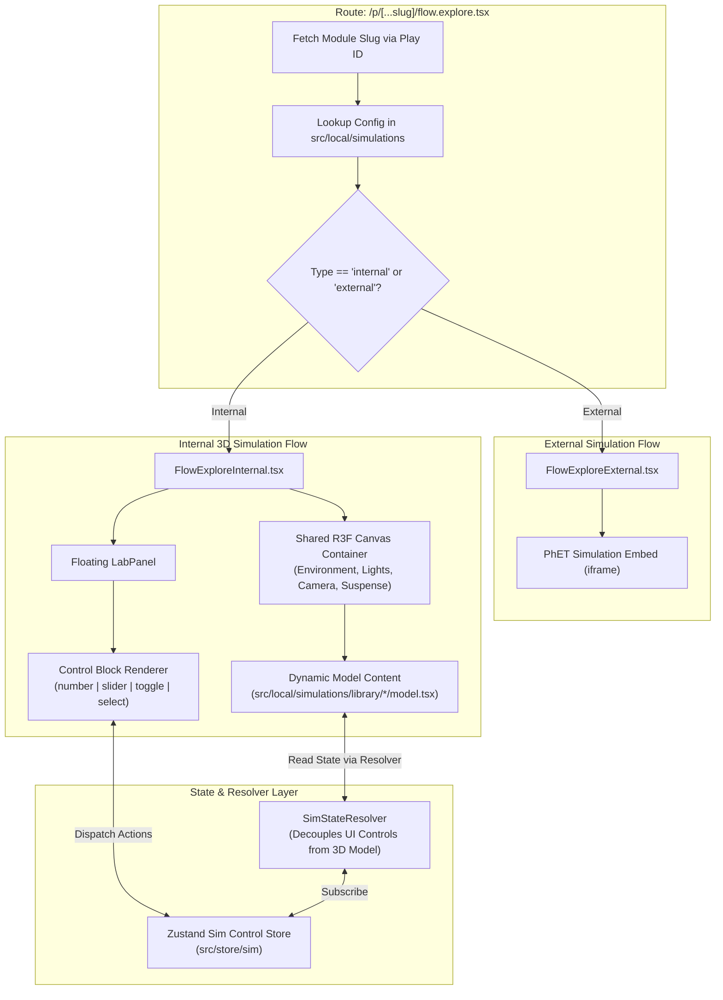

# Interactive Simulation Pipeline & Exploration Architecture

**Date**: August 12, 2026  
**Target Path**: `src/local/simulations` & `src/app/(new)/p/[...slug]/flow.explore.tsx`  
**Status**: Proposal & Technical Specification  

---

## 🏗️ Executive Architectural Summary

This document outlines the end-to-end technical architecture for the **Interactive 3D Lab Simulation Engine** in OpenLearnXR. It defines how interactive simulations are resolved, controlled, and rendered across both internal Three.js (React Three Fiber) scenes and external iframe embeds (e.g. PhET simulations).

The architecture bridges the initial pilot phase (8 predefined curriculum modules in `docs/pilot.md` / `prisma/seed.ts`) with the long-term data-driven production model (`ModuleVersion.interactiveConfig Json` schema at `prisma/schema.prisma:L318`).

### Core Architectural Pillars
1. **Divergent Route Flow (`flow.explore.tsx`)**: Resolves module metadata by slug, seamlessly branching between external iframe embeds (PhET) and internal Three.js (R3F) scenes.
2. **Single Shared Canvas Injection**: Prevents WebGL context re-initialization overhead by mounting **one shared `<Canvas>` container** with standardized lighting, environment, camera, and controls, while individual models only inject their 3D apparatus/meshes.
3. **Zustand Control State + Resolver Adapter**: Standardizes control inputs (`number`, `slider`, `toggle`, `select` from the AI Data Spec) into a central store, isolating UI controls from 3D model render logic via a bi-directional resolver.

---

## 📐 System Architecture Diagram



---

## 📁 1. Simulation Registry & Type Definitions (`src/local/simulations`)

### Data Model (`src/local/simulations/types.ts`)
Controls strictly map to 4 types (`number`, `slider`, `toggle`, `select`) matching the PDF spec.

```typescript
export type ControlType = 'number' | 'slider' | 'toggle' | 'select';

export interface BaseControl {
  label: string;
  description: string;
  type: ControlType;
}

export interface NumberControl extends BaseControl {
  type: 'number';
  value: number;
  defaultValue: number;
  min?: number;
  max?: number;
  step?: number;
}

export interface SliderControl extends BaseControl {
  type: 'slider';
  value: number;
  defaultValue: number;
  min: number;
  max: number;
  step?: number;
}

export interface ToggleControl extends BaseControl {
  type: 'toggle';
  value: boolean;
  defaultValue: boolean;
}

export interface SelectControl extends BaseControl {
  type: 'select';
  value: string;
  defaultValue: string;
  options: string[];
}

export type SimulationControl = 
  | NumberControl 
  | SliderControl 
  | ToggleControl 
  | SelectControl;

export type SimulationType = 'internal' | 'external';

export interface InternalSimulationConfig {
  type: 'internal';
  slug: string;
  name: string;
  controls: SimulationControl[];
  Model: React.ComponentType<{ slug: string }>;
}

export interface ExternalSimulationConfig {
  type: 'external';
  slug: string;
  name: string;
  embedLink: string;
}

export type LocalSimulationConfig = InternalSimulationConfig | ExternalSimulationConfig;
```

### Central Registry Map (`src/local/simulations/index.ts`)

```typescript
import { LocalSimulationConfig } from './types';
import { daltonsAtomConfig } from './library/1.model_daltons_atom_and_orbitals';
import { chemicalBondingConfig } from './library/2.chemical_bonding';
import { enthalpyChangesConfig } from './library/3.determine_enthalpy_changes';
import { capacitorsConfig } from './library/4.series_and_parallel_connections_of_capacitors';
import { frictionConfig } from './library/5.forces_and_motion_coefficient_of_frictio';
import { shmConfig } from './library/6.simple_harmonic_motion';
import { energyFormsConfig } from './library/7.energy_forms_and_changes';
import { opticsConfig } from './library/8.geometric_optics';

export const SIMULATION_REGISTRY: Record<string, LocalSimulationConfig> = {
  'model-daltons-atom-and-orbitals': daltonsAtomConfig,
  'chemical-bonding': chemicalBondingConfig,
  'determine-enthalpy-changes': enthalpyChangesConfig,
  'series-and-parallel-connections-of-capacitors': capacitorsConfig,
  'forces-and-motion-coefficient-of-friction': frictionConfig,
  'simple-harmonic-motion': shmConfig,
  'energy-forms-and-changes': energyFormsConfig,
  'geometric-optics': opticsConfig,
};

export function getSimulationConfig(slug: string): LocalSimulationConfig | undefined {
  return SIMULATION_REGISTRY[slug];
}
```

---

## 🧠 2. State Management & Resolver Layer (`src/store/sim`)

### Store Architecture (`src/store/sim/sim-control.store.ts`)

```typescript
import { create } from 'zustand';
import { SimulationControl } from '@/local/simulations/types';

type ControlValue = number | boolean | string;

interface ISimControlStore {
  activeSlug: string | null;
  controls: SimulationControl[];
  values: Record<string, ControlValue>;

  initializeSimulation: (slug: string, initialControls: SimulationControl[]) => void;
  updateControlValue: (label: string, value: ControlValue) => void;
  resetControls: () => void;
}

export const useSimControlStore = create<ISimControlStore>((set) => ({
  activeSlug: null,
  controls: [],
  values: {},

  initializeSimulation: (slug, initialControls) => {
    const initialValues: Record<string, ControlValue> = {};
    initialControls.forEach((ctrl) => {
      initialValues[ctrl.label] = ctrl.value;
    });

    set({
      activeSlug: slug,
      controls: initialControls,
      values: initialValues,
    });
  },

  updateControlValue: (label, value) =>
    set((state) => ({
      values: { ...state.values, [label]: value },
    })),

  resetControls: () =>
    set((state) => {
      const resetValues: Record<string, ControlValue> = {};
      state.controls.forEach((ctrl) => {
        resetValues[ctrl.label] = ctrl.defaultValue;
      });
      return { values: resetValues };
    }),
}));
```

### The Resolver Adapter Pattern (`src/local/simulations/resolver.ts`)

The **Resolver** provides clean, type-safe getters for the 3D model scenes, preventing standard component files from subscribing to global store internals directly:

```typescript
import { useSimControlStore } from '@/store/sim/sim-control.store';

export const useSimResolver = () => {
  const values = useSimControlStore((state) => state.values);
  const updateControlValue = useSimControlStore((state) => state.updateControlValue);

  return {
    getValue: <T extends number | boolean | string>(label: string, fallback: T): T => {
      return (values[label] as T) ?? fallback;
    },
    setValue: (label: string, value: number | boolean | string) => {
      updateControlValue(label, value);
    },
  };
};
```

---

## 🎛️ 3. Control Blocks Architecture (`src/components/(new)/control-blocks`)

Modular control UI components created for each input widget type:
- `StepperControlBlock.tsx` (`type === "number"`)
- `SliderControlBlock.tsx` (`type === "slider"`)
- `ToggleControlBlock.tsx` (`type === "toggle"`)
- `SelectControlBlock.tsx` (`type === "select"`)
- `ControlBlockDispatcher.tsx` (master pattern-matching dispatcher)

```tsx
'use client';

import { SimulationControl } from '@/local/simulations/types';
import { match } from 'ts-pattern';
import StepperControlBlock from './StepperControlBlock';
import SliderControlBlock from './SliderControlBlock';
import ToggleControlBlock from './ToggleControlBlock';
import SelectControlBlock from './SelectControlBlock';

interface Props {
  control: SimulationControl;
  value: any;
  onChange: (value: any) => void;
}

export default function ControlBlockDispatcher({ control, value, onChange }: Props) {
  return match(control)
    .with({ type: 'number' }, (c) => (
      <StepperControlBlock control={c} value={value as number} onChange={onChange} />
    ))
    .with({ type: 'slider' }, (c) => (
      <SliderControlBlock control={c} value={value as number} onChange={onChange} />
    ))
    .with({ type: 'toggle' }, (c) => (
      <ToggleControlBlock control={c} value={value as boolean} onChange={onChange} />
    ))
    .with({ type: 'select' }, (c) => (
      <SelectControlBlock control={c} value={value as string} onChange={onChange} />
    ))
    .exhaustive();
}
```

---

## 🎨 4. Shared Canvas & Model Scene Injection

Models inject mesh geometries and scene trees into the shared Canvas shell while subscribing reactively to control values via `useSimResolver()`.

```tsx
// src/local/simulations/library/1.model_daltons_atom_and_orbitals/model.tsx
'use client';

import { useSimResolver } from '@/local/simulations/resolver';
import { Sphere } from '@react-three/drei';

export default function DaltonsAtomModel() {
  const { getValue } = useSimResolver();

  const selectedModel = getValue('Select Atomic Model', "Dalton's Sphere");
  const selectedOrbital = getValue('Select Orbital View', '1s Orbital');
  const showLabels = getValue('Toggle Quantum Labels', false);

  return (
    <group position={[0, 0, 0]}>
      {selectedModel === "Dalton's Sphere" && (
        <Sphere args={[1.5, 32, 32]}>
          <meshStandardMaterial color="#3b82f6" roughness={0.3} metalness={0.2} />
        </Sphere>
      )}
    </group>
  );
}
```

---

## 🔄 5. Route Flow Implementation (`flow.explore.tsx`)

### Exploration Controller (`flow.explore.tsx`)

```tsx
'use client';

import { match } from 'ts-pattern';
import { getSimulationConfig } from '@/local/simulations';
import FlowExploreInternal from './flow.explore.internal';
import FlowExploreExternal from './flow.explore.external';

interface Props {
  slug: string;
}

export default function ExploreFlow({ slug }: Props) {
  const config = getSimulationConfig(slug);

  if (!config) {
    return <div className="p-8 text-center">Simulation configuration not found for slug: {slug}</div>;
  }

  return (
    <div className="relative flex-1 flex flex-col bg-surface-white size-full min-h-0 overflow-hidden">
      {match(config)
        .with({ type: 'internal' }, (c) => <FlowExploreInternal config={c} />)
        .with({ type: 'external' }, (c) => <FlowExploreExternal embedLink={c.embedLink} />)
        .exhaustive()}
    </div>
  );
}
```

### Shared R3F Canvas Shell (`flow.explore.internal.tsx`)

```tsx
'use client';

import { useEffect } from 'react';
import { Canvas } from '@react-three/fiber';
import { OrbitControls, Environment, ContactShadows } from '@react-three/drei';
import { InternalSimulationConfig } from '@/local/simulations/types';
import { useSimControlStore } from '@/store/sim/sim-control.store';
import DynamicLabPanel from './components/DynamicLabPanel';

interface Props {
  config: InternalSimulationConfig;
}

export default function FlowExploreInternal({ config }: Props) {
  const initializeSimulation = useSimControlStore((state) => state.initializeSimulation);
  const Model = config.Model;

  useEffect(() => {
    initializeSimulation(config.slug, config.controls);
  }, [config, initializeSimulation]);

  return (
    <div className="relative size-full flex flex-col">
      <div className="flex-1 relative size-full">
        <Canvas camera={{ position: [0, 2, 5], fov: 45 }}>
          <ambientLight intensity={0.7} />
          <directionalLight position={[10, 10, 5]} intensity={1.2} castShadow />
          
          <Model slug={config.slug} />
          
          <ContactShadows position={[0, -1.5, 0]} opacity={0.4} scale={10} blur={1.5} />
          <OrbitControls makeDefault enablePan minDistance={2} maxDistance={10} />
          <Environment preset="city" />
        </Canvas>
      </div>

      <DynamicLabPanel />
    </div>
  );
}
```

### External View Shell (`flow.explore.external.tsx`)

```tsx
'use client';

interface Props {
  embedLink: string;
}

export default function FlowExploreExternal({ embedLink }: Props) {
  return (
    <div className="flex-1 size-full relative overflow-hidden bg-black">
      <iframe
        src={embedLink}
        title="External Interactive Simulation"
        className="size-full border-none"
        allow="accelerometer; autoplay; clipboard-write; encrypted-media; gyroscope; picture-in-picture"
        allowFullScreen
      />
    </div>
  );
}
```

---

## 🚀 Post-Pilot Database Transition Plan

When transitioning from the pilot seed configuration to dynamic database generation:
1. `ModuleVersion.interactiveConfig Json` will store `SimulationControl[]` JSON payload.
2. The explore route will query `interactiveConfig` directly from Prisma.
3. If `interactiveConfig.embedLink` exists, it resolves dynamically to `external`; otherwise, it maps to `internal` R3F rendering.
